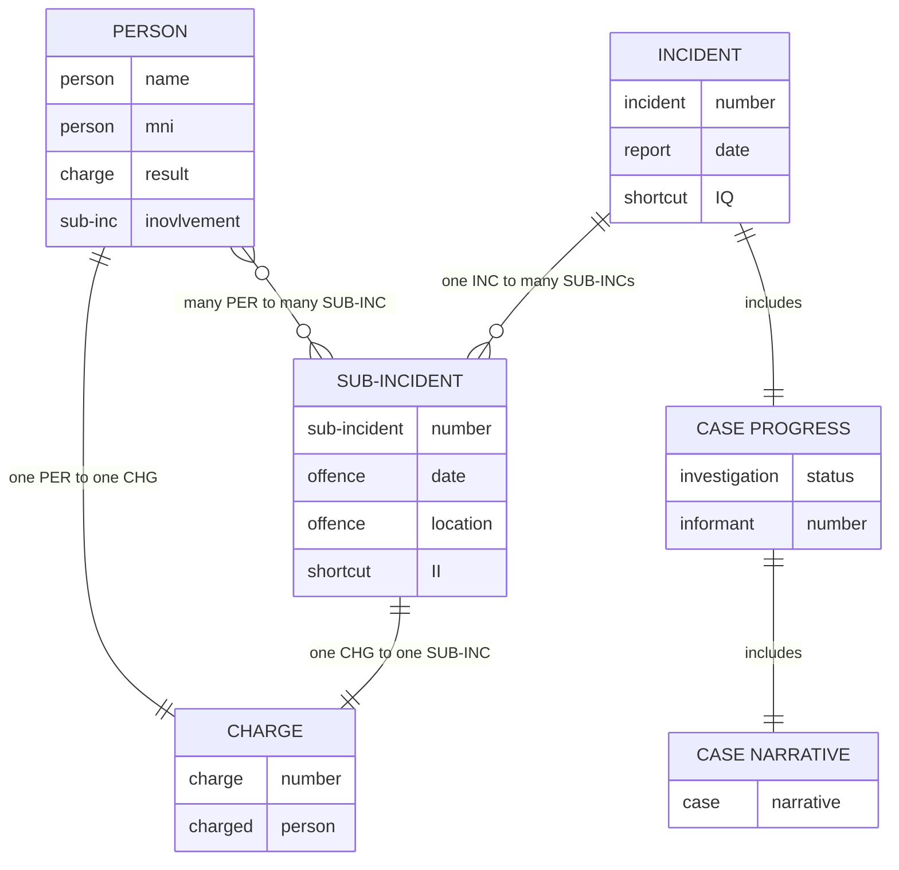
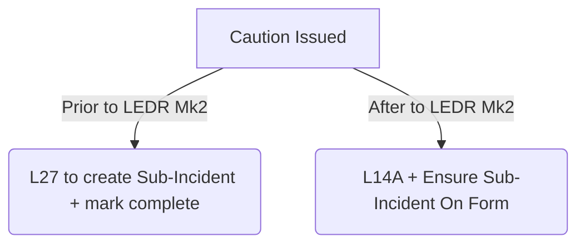

>[!WARNING] Work in Progress
>This page is currently being worked on.

This article covers the types of forms required to be submitted to the Central Data Entry Bureau (CDEB) when a suspect has been arrested (whether a summary arrest or indictable arrest) and processed for a matter.

>[!TIP] TIP: Understand Incidents & Sub-Incidents First
>It's a bit of reading and comprehension, but if you understand how Incidents and Sub-Incidents are recorded, you will understand offender process forms much better.
>[[47.03 Offender Processing Forms#^6a75e6|See Contextual Knowledge]]

# Contextual Knowledge
^6a75e6
## Incidents
An #incident is an occurrence of a criminal event and is created via LEDR Mk2 or submitting **INSERT LEAP FORM**. Incidents:
1. Provide basic details about the report.
2. Must be linked to at least 1 #sub-incident.
3. Provide a 'Case Progress', the screen which shows whether the matter is #active, #pended or #completed.

## Sub-Incidents
A #sub-incident describes:
1. **What** occurred
2. **When** something occurred
3. **Where** that something occurred
4. **Who** was involved in that something (e.g. witnesses, victims, suspects)
5. Records a **specific and distinct course of criminal conduct** within an incident.

## Charges
Charges on LEAP represent real charges laid against an offender. Charges can be laid via #summons, #bail, #remand or #warrants. 
Each #charge forms a link between a **person** and **sub-incident**. 

# Caution
A caution is issued to your offender per the [[Cautions]] framework (ensure you check VPMs to align with **current** policy).

Then depending on your below circumstances:

