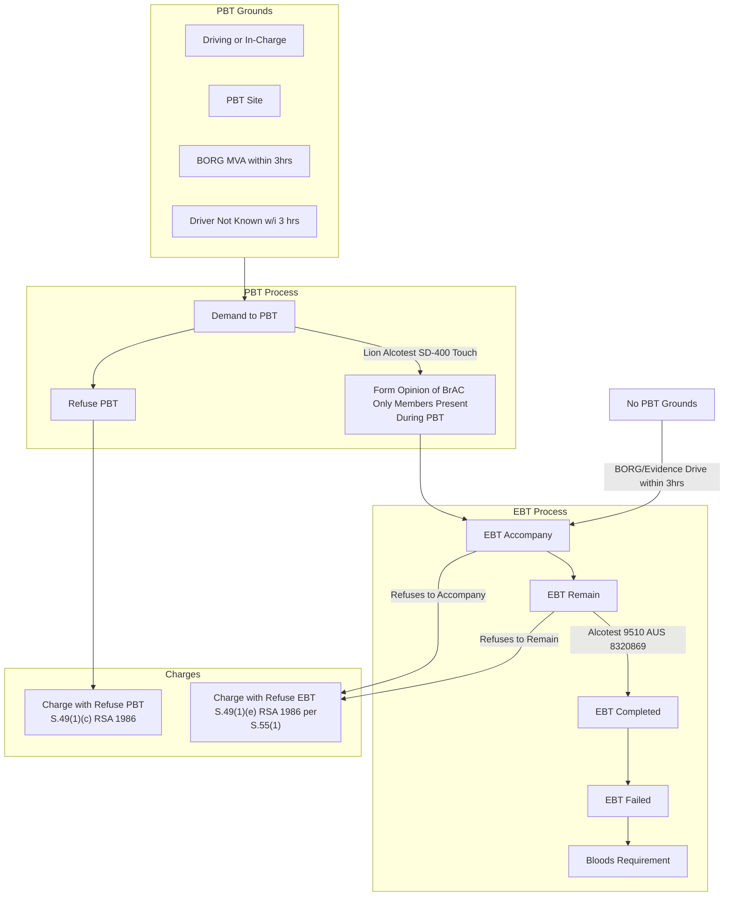

# Quick Reference 

Format for PDF sent to RPDAS:
- INSTRUMENT # - TEST # - SUBJECT SURNAME
- e.g. MRAH-0000 00001 SMITH

**PBT = Preliminary Breath Test
ACC = Request to Accompany
EBT = Evidentiary Breath Test**

![[Pasted image 20230921094532.png]]

# PBT's
The belief on reasonable grounds is met to conduct a #pbt if:
1. During the course of an #intercept; or
2. At a #testing-site; or
3. At a motor vehicle #accident

If  you are unable to conduct a #pbt then you can conduct an #ebt with belief on reasonable grounds if:
1. The driver makes #admissions; or
2. There were #witnesses to the driver driving; or
3. You #observed the driver driving.

# Legislation & Case Law

## Section 3AA - In Charge or Driving
>(1) Without limiting circumstances, following persons are in charge of MV if-
>	(a) person who is **attempting** to **start** or **drive** MV;
>	(b) person has **BORG** another **intends** to do (a);
>	(ba) person is vehicle supervisors of automated vehicle;
>	(c) commercial driving instructor while person being taught in charge;
>	(d) supervising driver sitting beside person being taught;

- The BORG for the **intention** to start or drive must be immediate, e.g. they must say "I am going to drive away as soon as you go away."
- Gillard v Wenborn (1988) covers sleeping. Sleeping is **not** considered to be in charge of a motor vehicle and therefore you should not PBT.
	- You can follow the EBT route, if you have evidence or BORG they were in charge in the last 3 hours.

## Offences
S.49 RSA 1986 covers this, remember offences occur **ANYWHERE**:
>(1) A person is guilt of an offence if (relevant to **motor vehicles**)-
>	(a) drives/in-charge + under influence of **liquor** / **drug** + **incapable** of **proper control**; or
>	(b) drives/in-charge + at or **more prescribed alcohol limit**; or
>	(ba) drives/in-charge + **impaired by drug**; or
>	(bb) drivers/in-charge + prescribed concentration of drugs or more; or
>	(bc) drives/in-charge whilst **both**-
>		(i) prescribed **alcohol** limit; and
>		(ii) prescribed concentration of **drugs**; or
>	(c) **refuses** to undergo PBT under s.53; or
>	(ca) **refuses** to undergo drug assessment under s.55A/55A(1); or
>	(d) **refuses/fails** to comply with request/signal to stop + remain stopped under s.54(3); or
>	(e) **refuses** to comply with s.55(1), (2), (2AA), (2A) or (9A); or
>	(ea) **refuses** to comply with s. 55B(1) or 55BA(2); or
>	(eb) **refuses** to provide sample oral fluid under s.55D/55E; or
>	(f) **within 3 hours** driving/in-charge furnishes **breath** for analysis under s.55 and-
>		(i) result indicates more than alcohol limit; and
>		(ii) concentration not solely present due to consumption after driving/being in-charge; or
>	(g) had sample of **blood** taken under s.55, 55B, 55BA, 55E or 56 **within 3 hours** of driving/in-charge and-
>		(i) sample analysed within 12 months under s.57; and
>		(ii) concentration of alcohol found by analyst not to be present due to solely consumption of alcohol after driving/in-charge; or
>	(h) **within 3 hours** driving/in-charge provides **sample of oral fluid** under s.55E and-
>		(i) sample analysed by properly qualified analyst under s.57B + found illicit drug present; and
>		(ii) presence of drug not solely due to consumption after driving/in-charge; or
>	(1)(i) sample of **blood** taken under s.55, 55B, 55BA, 55E or 56 **within 3 hours** and-
>		(i) sample analysed under s.57 found illicit **drug**; and
>		(ii) presence of drug not solely due to consumption after driving/in-charge; or
>	(j) sample of **blood** taken under s.55, 55B, 55BA, 55E or 56 **within 3 hours** and-
>		(i) sample analysed within 12 months by analyst under s.57 finding both-
>		(A) **alcohol** over limited; and
>		(B) illicit **drug** present
>			(ii) concentration of alcohol found by analyst not to be present due to solely consumption of alcohol after driving/in-charge; or 
>			(iii) presence of drug not solely due to consumption after driving/in-charge;

- s.49(1)(a) you need **evidence** of **lack of control**, e.g. witness statement describing the specific lack of control
- s.49(1)(b) Exceed Prescribed Concentration of Alcohol (XPCA) which-
	- Must be found driving or in-charge of motor vehicle; and
	- Occurs at time and place of where the driver was located driving; and
	- Can be outside the 3 hour timing; and
	- Can be proven via breath or bloods
- s.49(1)(f) - Prescribed Concentration of Alcohol or more in breath
	- Only occurs within 3 hours; and
	- Presumption that the reading is not due solely to consumption of alcohol after driving or being in-charge. E.g. the defence of "I had a drink when I got home."
	- You might use this charge parallel to s.49(1)(b) in case something gets contested, you have a back-up that is outside of the 3 hour timing. As long as you FOUND them driving or in-charge.
- s.49(1)(g) Exceed Prescribed Concentration of Alcohol via Bloods
	- Occurs at time and place where bloods were taken; and
	- Bloods must be taken within 3 hours; and
	- Presumption that the reading is not due solely to consumption of alcohol after driving or being in-charge. E.g. the defence of "I had a drink when I got home."

## Common Defences
- Re. s.49(1)(f) P.C.A. in Breath
	- Instrument is not in working order; or
	- Instrument is not being properly operated
	- Ensure you operate the instrument correctly and that it is working PRIOR to using it for a breath sample, e.g. test print, check paper, etc.
- Re. s.49(1)(g) P.C.A. in Blood
	- Blood has not been analysed correctly